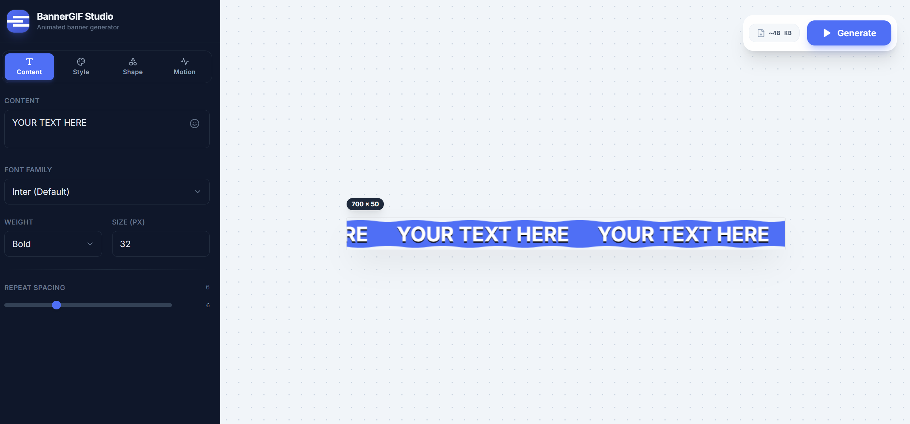
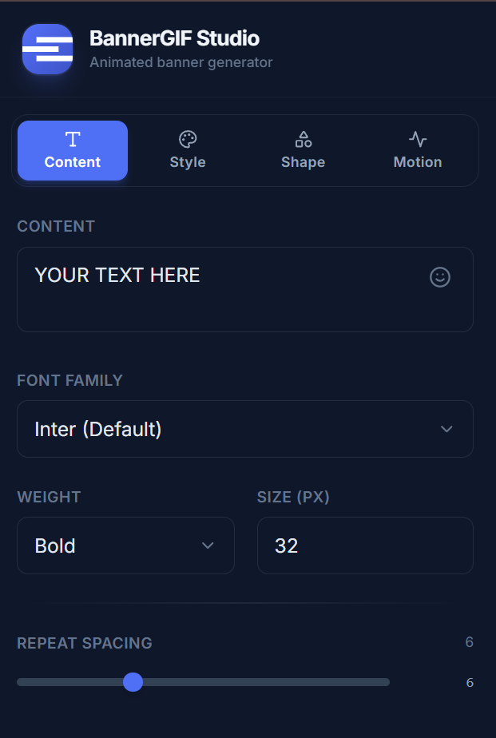
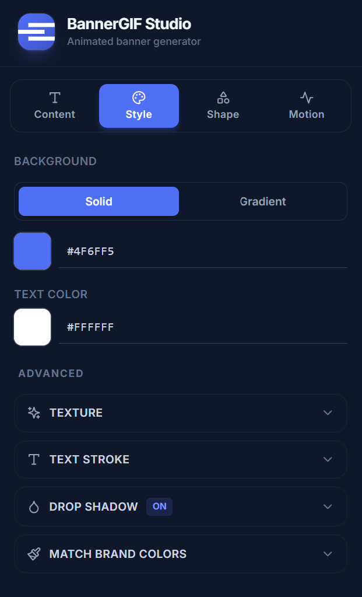
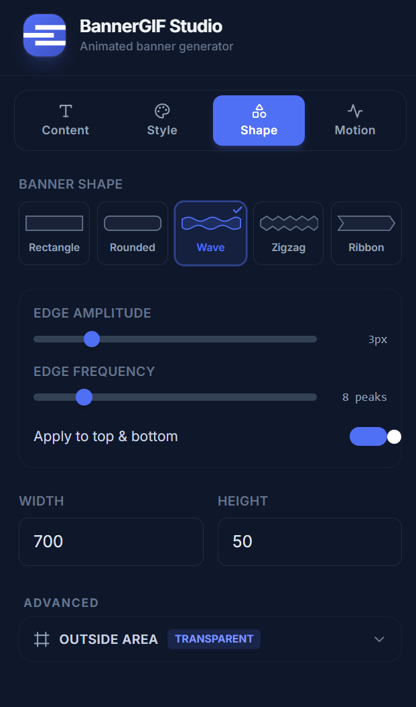
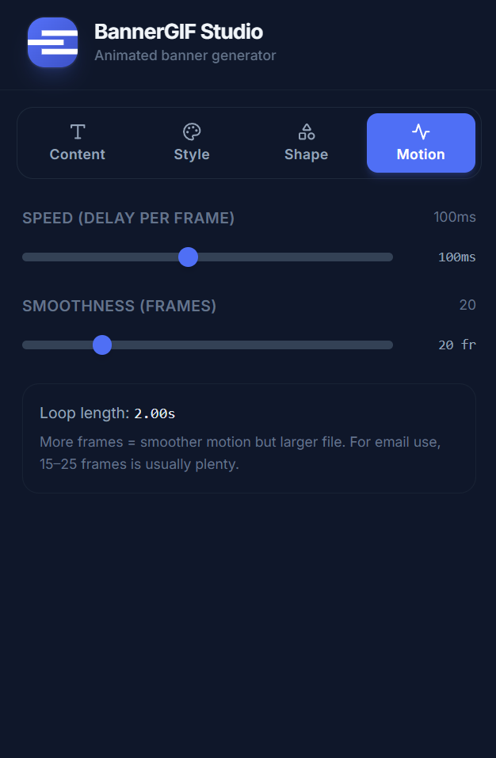
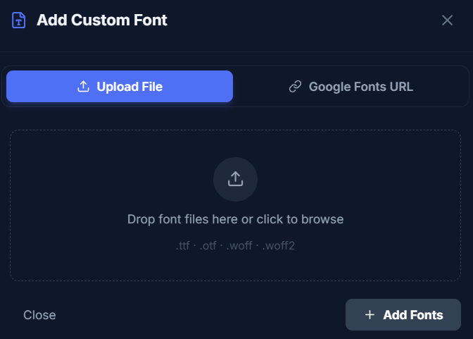
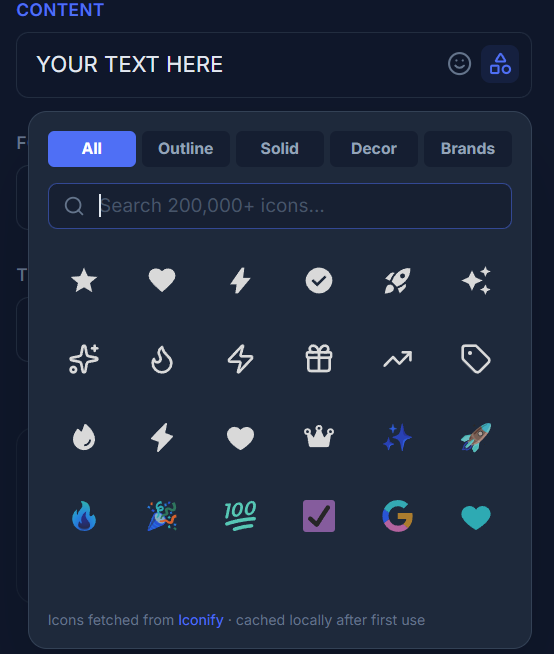
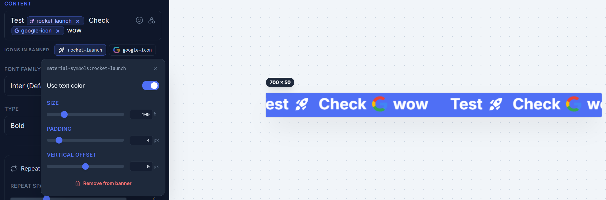

<div align="center">


# BannerGIF Studio

### Animated banner GIFs (and static JPEG / PNG / WebP) for email, popups, and the web

<em>Free · In-browser · No signup · No watermark</em>

<br>



<br>
<br>

[Features](#features) · [Use cases](#use-cases) · [Run locally](#run-locally) · [Tech stack](#tech-stack) · [License](#license)

</div>

---

## What it is

BannerGIF Studio turns a line of text and a handful of style choices into a perfectly-looping animated banner — the kind that scrolls across an email header, a website announcement bar, or a popup hero strip.

You can also export the same design as a **static JPEG, PNG, or WebP** when an animated banner isn't appropriate (Outlook, dark-mode quirks, social-media headers).

Everything happens in your browser. Nothing is uploaded. You get a downloadable file in a click.

## Who it's for

- **Email designers** building Gmail / Mailchimp / Klaviyo headers and announcement strips
- **Marketing teams** producing sale banners, countdowns, and announcement bars
- **Popup designers** for Klaviyo, OptinMonster, Privy, Sumo, etc.
- **Social-media managers** making LinkedIn covers, X/Twitter headers, Discord/Slack banners
- **Web designers** who need a quick announcement strip without firing up After Effects

---

## Features

<table>
<tr>
<td width="50%" valign="top">

### Typography
60+ Google Fonts across sans, serif, display, retro, and script families. Pick weight + style as one combined "Type" picker. Adjustable size, repeat spacing, alignment, and pixel offset for non-marquee layouts.

</td>
<td width="50%" valign="top">



</td>
</tr>

<tr>
<td width="50%" valign="top">



</td>
<td width="50%" valign="top">

### Style & Effects
Solid or **advanced gradient** background (linear/radial, 2–4 stops, visual angle dial). Textures — stripes, dots, grid, checker, noise — with color, opacity, scale, and angle controls. Text stroke + drop shadow. **Brand-color extractor**: upload your logo, get the top 5 colors as a one-click palette.

</td>
</tr>

<tr>
<td width="50%" valign="top">

### Banner Shapes
Pick from **rectangle, rounded, wave, zigzag, or ribbon** — each with adjustable parameters that appear only when relevant (corner radius, edge amplitude + frequency, notch depth). Transparent-outside support means shaped banners drop onto any background cleanly.

</td>
<td width="50%" valign="top">



</td>
</tr>

<tr>
<td width="50%" valign="top">



</td>
<td width="50%" valign="top">

### Motion Control
Dial in scroll speed (per-frame delay) and smoothness (frame count). Live loop-length readout. The preview canvas runs the exact same render path as the exporter — what you see is what you get.

</td>
</tr>

<tr>
<td width="50%" valign="top">

### Custom Fonts
Upload your own typeface (`.ttf`, `.otf`, `.woff`, `.woff2`) or paste a Google Fonts CSS URL — the importer parses every `@font-face` variant in the response and loads them all at once. **Variable fonts are detected automatically** via the OpenType `fvar` table, exposing every standard CSS weight from Thin to Black under a single family. Fonts persist locally via IndexedDB so they survive reloads. The picker grows a "Custom" tab as soon as you have at least one — invisible otherwise.

</td>
<td width="50%" valign="top">



</td>
</tr>

<tr>
<td width="50%" valign="top">



</td>
<td width="50%" valign="top">

### Icons & Emoji
Drop inline icons next to your text from the **Iconify** library — 200,000+ icons across 200+ sets. Filter by style: **Outline** (Lucide, Tabler, Heroicons), **Solid** (Material Symbols, MDI, Phosphor), **Decorative** (Noto, Twemoji, OpenMoji), or **Brands** (Logos, Simple Icons, Devicon). Icons render as clean chips in the text editor — backspace removes the whole chip atomically. Per-icon settings (color, size %, padding, vertical offset) live in a click-to-edit popover under each chip. Native emoji picker is right there too, for when you just want 🚀.

</td>
</tr>
</table>

<p align="center">
  
</p>

<p align="center">
  <em>Icons live inline in the text editor as chips — click any chip below the input to tune its color, size, padding, and vertical offset. The canvas updates instantly and the same chip layout exports to GIF, PNG, WebP, or JPEG.</em>
</p>

### Export

Pick between **Animated** and **Static** output. Animated produces a looping GIF; static produces a single-frame image in your choice of format.

| Format | Mode | When to use |
|---|---|---|
| **GIF** | Animated | Default. Universal email-client support. |
| **JPEG** | Static | Smallest file, lossy compression — good for photographic backgrounds. |
| **PNG** | Static | Lossless. Outlook fallbacks or when you need pixel-perfect quality. |
| **WebP** | Static | ~30–50% smaller than PNG. Modern browsers and email clients. |

The preview updates instantly when you switch formats — what you see is exactly what gets exported. Live KB estimate before generation; actual KB after. Success toast confirms when your file is ready.

---

## Use cases

| Channel | Notes |
|---|---|
| Email header (Gmail / Mailchimp) | Keep GIF under 1 MB for inboxes |
| Klaviyo / OptinMonster popup strip | |
| Website announcement bar || Set width to your site max |
| LinkedIn cover | |
| X / Twitter header | |
| Slack / Discord banner |  |

---

## Run locally

```bash
npm install
npm run dev
```

Then open `http://localhost:5173`.

## Build for production

```bash
npm run build
npm run preview
```

Static output lives in `dist/` and deploys to any static host. The included `netlify.toml` is preconfigured for Netlify.

---

## Tech stack

| Layer | Choice |
|---|---|
| Framework | React 18 + TypeScript |
| Build | Vite 5 |
| Styling | Tailwind CSS 3 |
| GIF encoding | [`gif.js`](https://github.com/jnordberg/gif.js) (Web Worker) |
| JPEG / PNG / WebP encoding | Native `HTMLCanvasElement.toBlob()` |
| Inline icons | [Iconify](https://iconify.design) (200,000+ icons, fetched on demand, cached locally) |
| Emoji | `emoji-picker-react` |
| UI icons | `lucide-react` |
| Custom font storage | IndexedDB via [`idb-keyval`](https://github.com/jakearchibald/idb-keyval) |
| Variable-font detection | In-browser TTF/OTF `fvar` table parser |
| Host | Netlify (static) |

All rendering happens client-side on a single `<canvas>` — no backend, no API keys, no telemetry.

## Project layout

```
src/
├── App.tsx                          – top-level layout, holds BannerConfig + customFonts state
├── types.ts                         – BannerConfig schema, DEFAULT_CONFIG, catalogs
├── components/
│   ├── ConfigPanel.tsx              – sidebar shell + tab bar + Arcady footer
│   ├── GradientEditor.tsx           – multi-stop gradient editor with angle dial
│   ├── ShapePicker.tsx              – visual shape picker (SVG thumbnails)
│   ├── PreviewArea.tsx              – live canvas preview + format toggle + Generate
│   ├── CustomFontModal.tsx          – upload + Google Fonts URL importer (multi-file, multi-variant)
│   ├── IconPicker.tsx               – Iconify search popover with style filters
│   ├── IconChipRow.tsx              – per-icon settings popover (color, size, padding, offset)
│   ├── TextareaWithTokens.tsx       – contentEditable editor that renders tokens as inline chips
│   ├── tabs/{Content,Style,Shape,Motion}Tab.tsx
│   └── ui/Field.tsx                 – Label, ColorField, SliderField (editable), Collapsible, Toggle
└── utils/
    ├── gifHelper.ts                 – drawBannerFrame (shared preview + export),
    │                                  segment-aware text + icon rendering,
    │                                  shape path tracing, texture overlays,
    │                                  generateBannerGif, generateStaticImage,
    │                                  measureOutputSizeKB (frame-sampled)
    ├── customFonts.ts               – IndexedDB-backed font store, fvar variable-axis parser,
    │                                  Google Fonts CSS multi-variant importer
    └── iconStore.ts                 – Iconify search + SVG cache + decoded-Image cache,
                                       inline-token parser ({{icon:set:name}})
```

The preview canvas and the encoders all call `drawBannerFrame()` so what you see is exactly what you export — every shape, texture, gradient, and effect renders identically across all output formats.

---

## License

MIT License

Copyright © 2025 Arcady Media Inc

Permission is hereby granted, free of charge, to any person obtaining a copy of this software and associated documentation files (the "Software"), to deal in the Software without restriction, including without limitation the rights to use, copy, modify, merge, publish, distribute, sublicense, and/or sell copies of the Software, and to permit persons to whom the Software is furnished to do so, subject to the following conditions:

The above copyright notice and this permission notice shall be included in all copies or substantial portions of the Software.

THE SOFTWARE IS PROVIDED "AS IS", WITHOUT WARRANTY OF ANY KIND, EXPRESS OR IMPLIED, INCLUDING BUT NOT LIMITED TO THE WARRANTIES OF MERCHANTABILITY, FITNESS FOR A PARTICULAR PURPOSE AND NONINFRINGEMENT. IN NO EVENT SHALL THE AUTHORS OR COPYRIGHT HOLDERS BE LIABLE FOR ANY CLAIM, DAMAGES OR OTHER LIABILITY, WHETHER IN AN ACTION OF CONTRACT, TORT OR OTHERWISE, ARISING FROM, OUT OF OR IN CONNECTION WITH THE SOFTWARE OR THE USE OR OTHER DEALINGS IN THE SOFTWARE.

---

<div align="center">

<br>


<br>

**Developed by [Arcady Media Inc](https://arcadymedia.com)**

<sub>Built with care for designers and marketers who'd rather not fight Photoshop for a 50-pixel banner.</sub>

</div>
